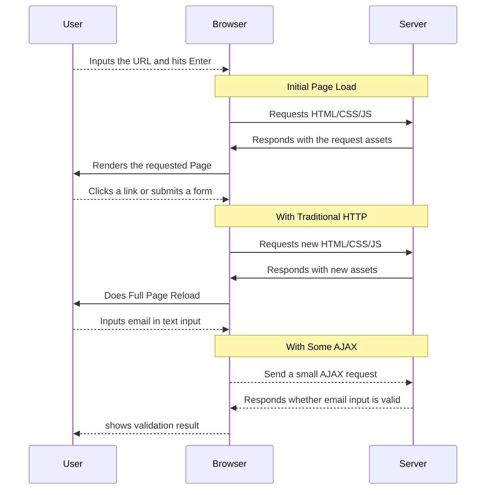

# History of React and Redux
## Traditional Web Apps (with some AJAX)

This is what a traditional web app with AJAX looks like:

AJAX provided a seamless user experience and a seeming performance boost to traditional web apps.

## Single Page Applications (SPA) and Rise of MV* Javascript Frameworks (2011)
People soon realized that AJAX be used for more than just simple validation requests.  If all the interactions and form submissions are done on the frontend, there will be no perceived load time after the initial page load, and users will have even more of a seamless experience.

As more and more companies (and developers) desired the responsiveness and performance of Single Page Apps, there was a rising need for a better way to manage views and models on the front-end, much like on the backend.

 (I didn't make that Meme)

All around the same time, a ton of frameworks came onto the scene. [Backbone](http://backbonejs.org/), [Ember](http://emberjs.com/),  [Angular](https://angularjs.org/), [CanJS](https://canjs.com/), [KnockoutJS](http://knockoutjs.com/), the list goes on..

Despite the explosion of frameworks, almost all of them shared these features:
* Models and collections to keep data from the server in-sync
* Extending Scheme to handle class inheritance
* A view system to quickly set views of the app via templates
* Simple Routing System
* Event/Observable system to notify other parts of the app when something happens
* Two-way binding between model and view representations:
  * Binding from the model to the view: when the model changes, the view changes.
  * Binding from the view to the model: when the view changes (via user input), the model changes.

## React and Flux Announced (2014)

When React was announce, large part of the JS community was feeling the **[JS framework fatigue](http://www.allenpike.com/2015/javascript-framework-fatigue/)**.  The common response was "Yet Another Framework?!", not only that, React was advocating a whole new syntax, JSX or Javascript as XML.  

If you watched the video on the [React Section](../react/README.md), you'll notice that, unlike React, Facebook didn't really release any software for Flux.  The speaker only talked about the idea of Flux and how it would untangle the mess of a two-way binding system in a large application.  I think they want to emphasize the beauty of Reach which is that it is so unconcerned with *how* the data gets into react, making it flexible enough to work with virtually any JS framework's view layer. 

Never the less, the questions posed by the audience at the end of that video, many of which were on the implementation of Flux, were indicative of how the community will step up in the months to come. 

## Flux implementations (2014-2015)
The community jumped on it to fill in the gap.  Before long, there were countless implementations of flux with a slightly different interpretations of the Flux architecture.  [Fluxxor](http://fluxxor.com/), [Alt](http://alt.js.org/), [McFly](https://github.com/kenwheeler/mcfly) just to name a few. 

There were SO many implementations, developers experienced a second wave of JS Fatigue, which led to this question on the [React Forum](https://discuss.reactjs.org/t/lost-on-what-flux-implementation-to-use/545):

Notice when this question was posted.

## Landmark Address (July 2015)
Just a month later, Dan Abramov, an unassuming developer, made this presentation at ReachEurope.

https://www.youtube.com/watch?v=xsSnOQynTHs

I imagined people in the audience were like ...

Even though Dan didn't even want to write a Flux implementation for his presentation, after his Redux framework was release, the surge of flux frameworks stopped.
> _**Note:**_ This observation was made by the host of [JS Jabber](https://devchat.tv/js-jabber/179-jsj-redux-and-react-with-dan-abramov)
